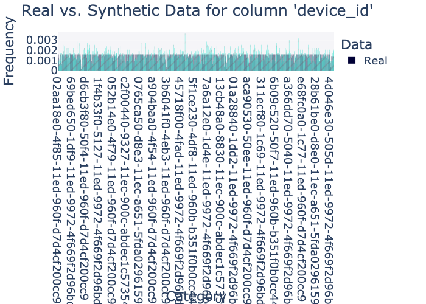
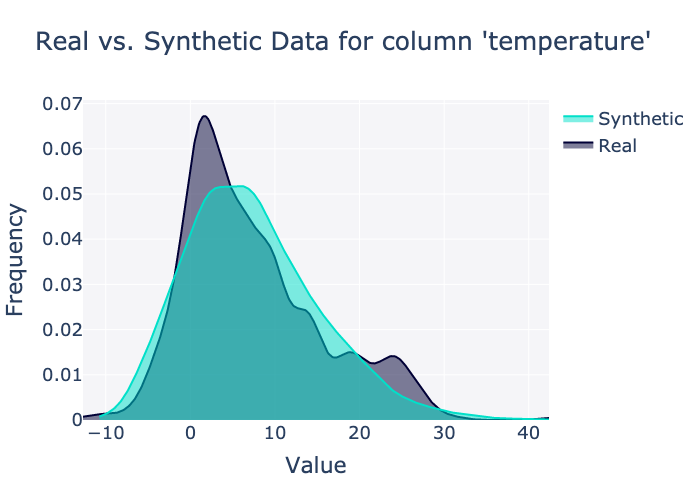
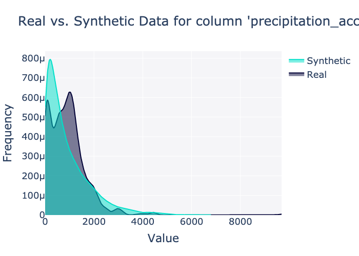
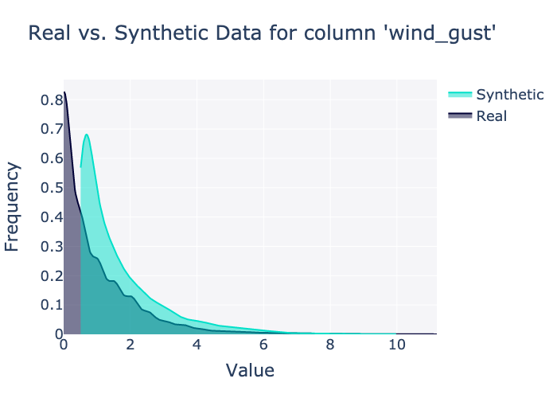
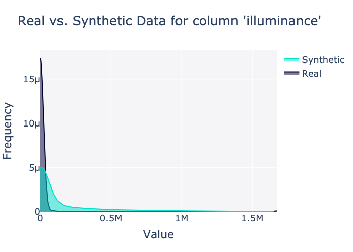
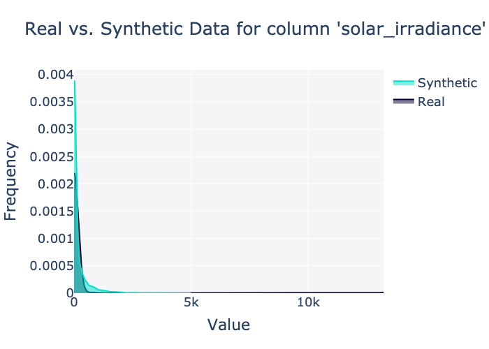
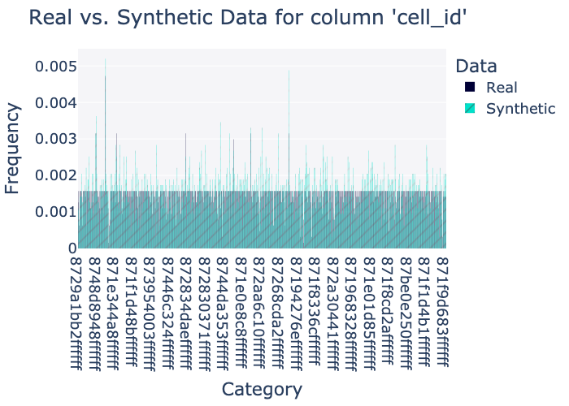

# Diagnostic & Quality Report

## Scores

### Diagnostic

Overall score: 100.00%

|    | Property       |   Score |
|---:|:---------------|--------:|
|  0 | Data Validity  |       1 |
|  1 | Data Structure |       1 |

### Quality

Overall score: 64.85%

|    | Property           |    Score |
|---:|:-------------------|---------:|
|  0 | Column Shapes      | 0.811723 |
|  1 | Column Pair Trends | 0.485342 |

By column: 

|    | Column                    | Metric       |    Score |
|---:|:--------------------------|:-------------|---------:|
|  0 | device_id                 | TVComplement | 0.871902 |
|  1 | timestamp                 | TVComplement | 0.98439  |
|  2 | temperature               | KSComplement | 0.914226 |
|  3 | humidity                  | KSComplement | 0.962504 |
|  4 | precipitation_accumulated | KSComplement | 0.880109 |
|  5 | wind_speed                | KSComplement | 0.59028  |
|  6 | wind_gust                 | KSComplement | 0.6215   |
|  7 | wind_direction            | KSComplement | 0.959929 |
|  8 | illuminance               | KSComplement | 0.733827 |
|  9 | solar_irradiance          | KSComplement | 0.334084 |
| 10 | fo_uv                     | KSComplement | 0.834567 |
| 11 | uv_index                  | TVComplement | 0.991954 |
| 12 | precipitation_rate        | KSComplement | 0.1458   |
| 13 | pressure                  | KSComplement | 0.904248 |
| 14 | name                      | TVComplement | 0.870937 |
| 15 | utc_datetime              | KSComplement | 0.899421 |
| 16 | model                     | TVComplement | 1        |
| 17 | cell_id                   | TVComplement | 0.872868 |
| 18 | lat                       | KSComplement | 0.922755 |
| 19 | lon                       | KSComplement | 0.762472 |
| 20 | rn                        | TVComplement | 0.988413 |

## Sample synthetic data

|    | device_id                            |     timestamp |   temperature |   humidity |   precipitation_accumulated |   wind_speed |   wind_gust |   wind_direction |   illuminance |   solar_irradiance |   fo_uv |   uv_index |   precipitation_rate |   pressure | name                     | utc_datetime        | model   | cell_id         |     lat |       lon |   rn |
|---:|:-------------------------------------|--------------:|--------------:|-----------:|----------------------------:|-------------:|------------:|-----------------:|--------------:|-------------------:|--------:|-----------:|---------------------:|-----------:|:-------------------------|:--------------------|:--------|:----------------|--------:|----------:|-----:|
|  0 | f2dad800-512d-11ed-960f-d7d4cf200cc9 | 1711324912000 |       4.30499 |         33 |                    743.646  |     0.980885 |  0.191779   |              189 |             0 |               0.01 |       0 |          0 |           0.0190807  |    985.076 | Misty Pumpkin Duststorm  | 2024-03-25 00:01:33 | WS1000  | 87396051effffff | 44.8322 |   16.45   |    8 |
|  1 | 22336600-5046-11ed-960f-d7d4cf200cc9 | 1711324832000 |       4.12194 |         60 |                    129.8    |     0.166037 |  0.00137105 |              298 |            90 |             137.86 |       2 |          0 |           0          |   1014.58  | Blurry Turquoise Season  | 2024-03-25 00:00:21 | WS1000  | 872656730ffffff | 35.8862 |  -66.5312 |    4 |
|  2 | d3894b00-50e0-11ed-960b-b351f0b0cc44 | 1711324864000 |      17.9962  |         69 |                    285.14   |     1.48244  |  1.61957    |              235 |            26 |             135.43 |       0 |          0 |           0.00674671 |   1003.32  | Calm Eggshell Drizzle    | 2024-03-25 00:00:34 | WS1000  | 8739048b3ffffff | 38.9751 |  -61.657  |    4 |
|  3 | 559a2ef0-1d3a-11ed-960f-d7d4cf200cc9 | 1711324880000 |      -1.76333 |         67 |                   1300.04   |     0.637114 |  0.372054   |              337 |             0 |               0.01 |       0 |          0 |           9.9974e-05 |    974.233 | Skinny Tweed Hurricane   | 2024-03-25 00:01:49 | WS1000  | 871fa4746ffffff | 45.5309 |   39.9141 |    8 |
|  4 | 3d5972d0-1c7f-11ed-960b-b351f0b0cc44 | 1711324880000 |      21.5577  |         22 |                    940.226  |     0.559523 |  0.478883   |              259 |           781 |            1488.8  |      47 |          0 |           0.395985   |    991.363 | Tart Nylon Climatologist | 2024-03-25 00:00:46 | WS1000  | 8739336c2ffffff | 20.8882 | -110.983  |    5 |
|  5 | 76b50110-4e99-11ed-960f-d7d4cf200cc9 | 1711324864000 |       9.83053 |         30 |                     46.6638 |     1.88795  |  0.381816   |               14 |          1031 |            1660.73 |      47 |          0 |           0          |    932.255 | Massive Basil Scorcher   | 2024-03-25 00:01:40 | WS1000  | 871959ab2ffffff | 55.6273 | -132.302  |    5 |
|  6 | e5731f20-4f92-11ed-960b-b351f0b0cc44 | 1711324896000 |       7.75348 |         73 |                    206.269  |     6.94959  |  6.11488    |              320 |             0 |               0.12 |       0 |          0 |           0.0270908  |    927.768 | Mean Zomp Lightning      | 2024-03-25 00:02:02 | WS1000  | 87441a881ffffff | 45.305  |   99.7949 |    8 |
|  7 | 0deed750-d8a6-11ec-960f-d7d4cf200cc9 | 1711324880000 |      19.9837  |         35 |                    148.333  |     0.429045 |  0.0520641  |              328 |            38 |             225.72 |       9 |          0 |           0.345939   |    951.425 | Quiet Tartan Cold        | 2024-03-25 00:01:58 | WS1000  | 871f029b5ffffff | 13.4709 |  -84.3206 |    8 |
|  8 | 36718e40-4de3-11ed-960f-d7d4cf200cc9 | 1711324864000 |       7.95517 |         39 |                     15.3191 |     0.085941 |  0.00193766 |              131 |            61 |              97.81 |       4 |          0 |           1.673e-06  |    980.859 | Rural Paisley Snowflake  | 2024-03-25 00:01:34 | WS1000  | 871e19d0bffffff | 28.8501 |   64.8676 |    5 |
|  9 | 9e2bf1f0-d8f5-11ec-a651-5fda0296159f | 1711324944000 |       6.19828 |         98 |                    481.507  |     5.99874  |  6.05994    |              348 |             6 |              20.12 |       0 |          0 |           1e-07      |   1017.49  | Cool Teal Hygrometer     | 2024-03-25 00:02:19 | WS1000  | 871f00298ffffff | 53.7025 |  -21.5337 |   10 |

## Plots

### Column plots

