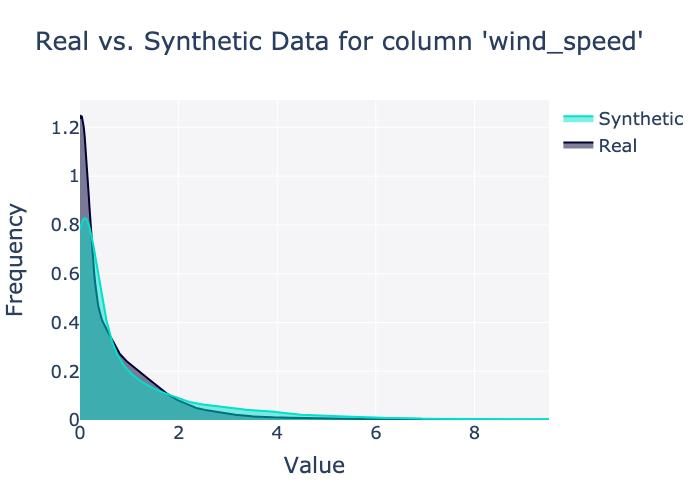
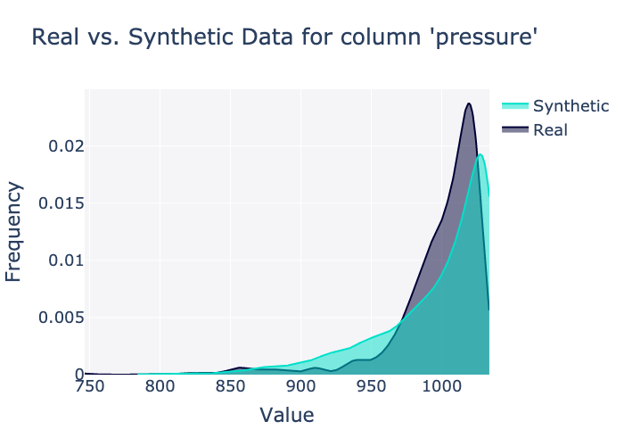

# Diagnostic & Quality Report

## Scores

### Diagnostic

Overall score: 100.00%

|    | Property       |   Score |
|---:|:---------------|--------:|
|  0 | Data Validity  |       1 |
|  1 | Data Structure |       1 |

### Quality

Overall score: 61.24%

|    | Property           |    Score |
|---:|:-------------------|---------:|
|  0 | Column Shapes      | 0.742563 |
|  1 | Column Pair Trends | 0.48231  |

By column: 

|    | Column                    | Metric       |     Score |
|---:|:--------------------------|:-------------|----------:|
|  0 | device_id                 | TVComplement | 0.872066  |
|  1 | timestamp                 | TVComplement | 0.990704  |
|  2 | temperature               | KSComplement | 0.94265   |
|  3 | humidity                  | KSComplement | 0.923113  |
|  4 | precipitation_accumulated | KSComplement | 0.865448  |
|  5 | wind_speed                | KSComplement | 0.570663  |
|  6 | wind_gust                 | KSComplement | 0.376241  |
|  7 | wind_direction            | KSComplement | 0.969749  |
|  8 | illuminance               | KSComplement | 0.361903  |
|  9 | solar_irradiance          | KSComplement | 0.247834  |
| 10 | fo_uv                     | KSComplement | 0.436742  |
| 11 | uv_index                  | TVComplement | 0.999527  |
| 12 | precipitation_rate        | KSComplement | 0.0204821 |
| 13 | pressure                  | KSComplement | 0.79833   |
| 14 | model                     | TVComplement | 1         |
| 15 | name                      | TVComplement | 0.873799  |
| 16 | utc_datetime              | KSComplement | 0.800693  |
| 17 | cell_id                   | TVComplement | 0.874902  |
| 18 | lat                       | KSComplement | 0.922956  |
| 19 | lon                       | KSComplement | 0.757366  |
| 20 | rn                        | TVComplement | 0.988656  |

## Sample synthetic data

|    | device_id                            |     timestamp |   temperature |   humidity |   precipitation_accumulated |   wind_speed |   wind_gust |   wind_direction |   illuminance |   solar_irradiance |   fo_uv |   uv_index |   precipitation_rate |   pressure | model   | name                         | utc_datetime        | cell_id         |     lat |       lon |   rn |
|---:|:-------------------------------------|--------------:|--------------:|-----------:|----------------------------:|-------------:|------------:|-----------------:|--------------:|-------------------:|--------:|-----------:|---------------------:|-----------:|:--------|:-----------------------------|:--------------------|:----------------|--------:|----------:|-----:|
|  0 | 593b07c0-5050-11ed-960f-d7d4cf200cc9 | 1706486512000 |       1.02153 |         47 |                    740.512  |   0.415032   |    1.3047   |              146 |             4 |               0.02 |       1 |          0 |                 3.64 |   1030.12  | WS1000  | Wonderful Seafoam Barometric | 2024-01-29 00:01:42 | 87194a7a3ffffff | 55.2813 |   69.7748 |    7 |
|  1 | a0a7a210-511f-11ed-960b-b351f0b0cc44 | 1706486448000 |      -3.28186 |         95 |                    202.398  |   2.3683e-05 |    0.51163  |               26 |          2672 |               4.55 |     522 |          0 |                 0.87 |   1016.26  | WS1000  | Curly Tomato Climate         | 2024-01-29 00:00:51 | 872888b9affffff | 35.8199 |   46.9732 |    3 |
|  2 | 7cc0cfc0-d8d4-11ec-960f-d7d4cf200cc9 | 1706486448000 |       9.42757 |         76 |                    357.427  |   0.23023    |    1.45846  |              133 |          5264 |              12.72 |       1 |          0 |                 0.12 |   1014.06  | WS1000  | Rich Sandstone Duststorm     | 2024-01-29 00:01:03 | 87194dc42ffffff | 44.9339 |  -66.452  |    5 |
|  3 | f57b6290-5124-11ed-960b-b351f0b0cc44 | 1706486528000 |      -6.66564 |         73 |                    857.514  |   0.940109   |    2.23794  |               82 |             0 |               0.01 |       0 |          0 |                 4.38 |   1020.69  | WS1000  | Old Magnolia Rainstorm       | 2024-01-29 00:01:23 | 8729a1d21ffffff | 49.1938 |   99.2478 |    8 |
|  4 | e5b61e70-4e88-11ed-960f-d7d4cf200cc9 | 1706486448000 |      10.5048  |         24 |                    376.247  |   0.0151904  |    0.62935  |              239 |        901545 |             797.39 |   15126 |          0 |                 0.45 |    978.096 | WS1000  | Narrow Mercurial Sunrise     | 2024-01-29 00:01:12 | 87ad368daffffff | 48.7096 | -101.81   |    5 |
|  5 | 77548ea0-4f58-11ed-9972-4f669f2d96bd | 1706486496000 |      25.787   |         93 |                   3974.72   |   0.0051592  |    0.581282 |               59 |        360956 |             536.02 |   46370 |          0 |                 4.82 |   1026.51  | WS1000  | Nice Sapphire Altocumulus    | 2024-01-29 00:00:30 | 871f8e6c6ffffff | 43.8934 | -103.819  |    7 |
|  6 | 7a9798d0-1dcd-11ed-960f-d7d4cf200cc9 | 1706486528000 |      12.7222  |         52 |                    692.835  |   6.75775    |    8.36108  |               24 |           931 |               2.58 |      55 |          0 |                 4.34 |   1014.67  | WS1000  | Flaky Pewter Easterlies      | 2024-01-29 00:00:49 | 871f8d051ffffff | 45.3093 |   25.9098 |    8 |
|  7 | 06756c60-1c7a-11ed-960f-d7d4cf200cc9 | 1706486512000 |       5.35957 |         21 |                    190.69   |   0.0858518  |    0.581952 |               47 |        328614 |             225.17 |   14839 |          0 |                 2.51 |    990.623 | WS1000  | Nutty Currant Condensation   | 2024-01-29 00:01:09 | 871fa199dffffff | 50.1266 | -119.904  |    8 |
|  8 | 0ae952e0-1ddb-11ed-960b-b351f0b0cc44 | 1706486496000 |       1.62991 |         71 |                    812.074  |   0.00024448 |    0.513053 |               16 |         76671 |              76.26 |    1032 |          0 |                 0.54 |   1015.78  | WS1000  | Fun Midnight Easterlies      | 2024-01-29 00:00:43 | 8728d16ceffffff | 48.437  |   91.9055 |    7 |
|  9 | 1d7777a0-5122-11ed-960b-b351f0b0cc44 | 1706486544000 |      10.2068  |         99 |                     17.6145 |   3.48855    |    5.53494  |              105 |          4466 |              10.95 |      20 |          0 |                 1.86 |    994.151 | WS1000  | Melted Brick Twister         | 2024-01-29 00:01:44 | 870981c49ffffff | 25.8645 |  -40.0334 |   10 |

## Plots

### Column plots

